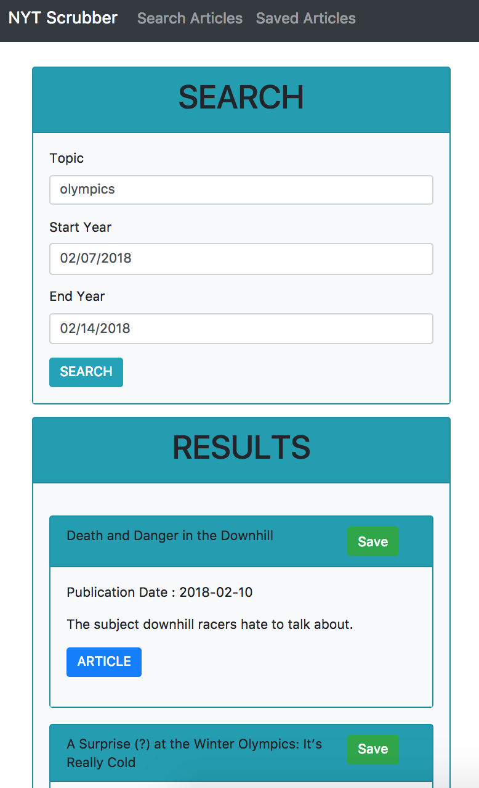

# NYT Scrubber

This is a personal project I am working on. I was experimenting with create-react-app and yarn to create a full-stack app that gets information from the New York Times API and allows you to save articles in a mongo database.

## Getting Started

To go to the Live Site go to https://nyt-react-cac.herokuapp.com/
Once there you can search for articles by date. Information is obtained through the NYT Article API
Each Article contains a title, date and a link that will lead you to the article in the New York Times site.

### Prerequisites

All you need is your browser. No install required. The site uses mongodb to store articles.
For more information on create-react-app and how it works go to https://github.com/facebook/create-react-app

## Built With

* mlab - Mongo Database (https://mlab.com/)
* React.js, create-react-app, Node.js, Express.js and Mongoose

## Authors

* **Cesar Caceres** - *Design and development* 

## Acknowledgments

* Powered by NYT API and React.js

